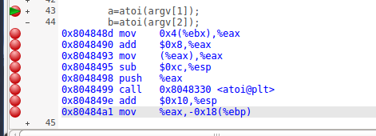
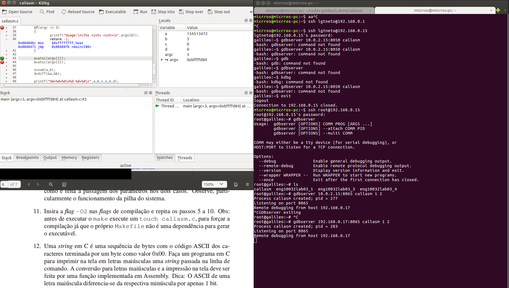
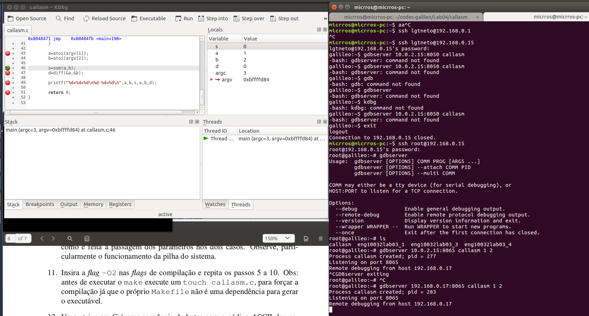
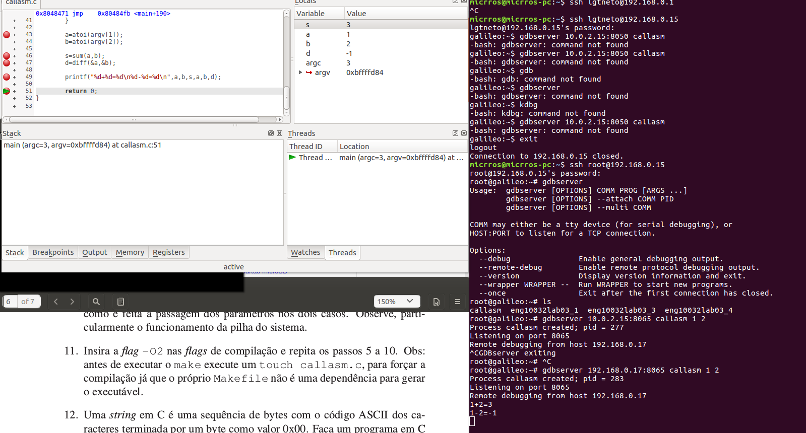

# LAB 04

## Theory

In C, the convention is that the parameters are placed by value into the stack, from the right to the left.
Usually in IA32 systems, the returned value of the function should be in the *eax* register (in a 32-bit-machine), or *edx:eax* (in a 62-bit-machine), or either in *st(0)* for floating point data.

## Experiments

### Debugging assembly code

#### On Galileo (set this up first)
```
gdbserver <IP_HOST>:<DEFINED_PORT> <PROGRAM> <PARAMETERS_SEPARATED_BY_WHITESPACES>
```

#### In the host machine

##### To install the debugging frontend
```
sudo apt install kdbg
```

##### To debug the program
```
kdbg -r <IP_GALILEO>:<DEFINED_PORT> <PROGRAM>
```

### Screenshots





