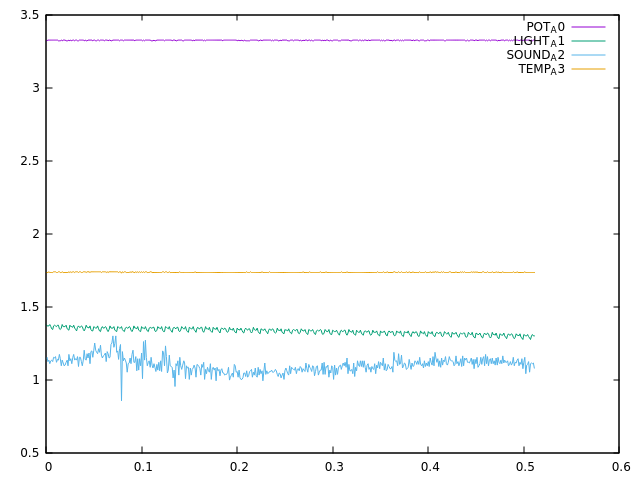

# LAB 07 | A/D CONVERTER

## Theory

The Galileo Gen2 has an A/D converter of 10 bits and 8 channels (6 available in the shield, pins *IO14* to *IO19*).

Besides, two modes are available: 
- One-shot.
- Continuous.

## Experiments

### Add a adc group and configure init script in the root
```
$ groupadd -r adc
$ groupmems -g adc -a <USERNAME>
$ cp ~/eng10032lab07_X /etc/init.d
$ chmod +x /etc/init.d/eng10032lab07_X
$ update-rc.d eng10032lab07_1 defaults
$ reboot
```

### Experiment 1 - Rotary (One-shot)

#### Host
```
$ cd rotary/
$ make
$ scp rotary <USERNAME>@<IP_GALILEO>
```

#### Galileo
```
$ ./rotary
```

[Watch it](https://photos.app.goo.gl/rf6PnjXVakGxDtuL9).

### Experiment 2 - Continuous

#### Host
```
$ cd continuous/
$ make
$ scp continuous <USERNAME>@<IP_GALILEO>
```

#### Galileo
```
$ ./continuous <FILE>
```

#### Get <FILE> from Galileo in the host
```
scp -r <USERNAME>@<IP_GALILEO>:/home/lgtneto/<FILE> <PATH_HOST>
```

#### Plot graphic
##### Install GNU Plot
```
$ sudo apt-get install gnuplot
```

##### Get graphic
```
sh plot.sh data.csv
```
[Watch it](https://photos.app.goo.gl/vp6TLqwQvgcJZp5P6).

##### Graphic


